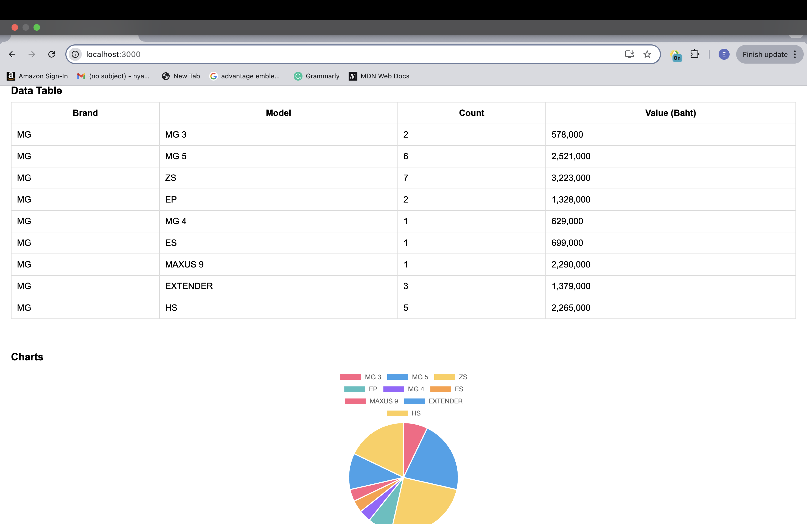

# Project01: Car Analytics

## Team Member:
Nyan Lin Htet(6430031) , Hein Htoo Naing(6440027), Sai Sy Hein(6420131)

---
## Git Repository

 [GitHub Repo](https://github.com/Garris711/WebProject/tree/main/car-analytics)

---

## Features

### Dashboard Page:
- **Table:** Displays the number of cars and their values (in Baht) by brand and model.
- **Pie Chart:** Illustrates the distribution of cars by brand.
- **Stacked Bar Chart:** Shows the number of car models for each brand.

### Highlighted Cars Page:
- **View Highlighted Cars:** Displays a list of highlighted cars.
- **Persistent Data:** Highlighted cars persist across page reloads using Local Storage.

---

## Technologies Used

### Languages & Frameworks


---

## Installation

To run this project locally:

1. **Clone the repository:**
    ```bash
    git clone https://github.com/yourusername/WebProject-car-analytics.git
    ```

2. **Navigate to the Project Directory:**
    ```bash
    cd WebProject/car-analytics
    ```

3. **Install Node.js and npm:**
    - Check Node.js version:
      ```
      node -v
      ```
    - Check npm version:
      ```
      npm -v 
      ```

4. **Install the dependencies:**
    ```
    npm install
    ```

5. **Start the server:**
    ```bash
    npm start
    ```

6. **Open your browser and go to:**
    ```
    http://localhost:3000
    ```

---

## Functions

### Dashboard Page:
- **Search Bar:** Seach the name of car Brand to see their data and details.
- **Table:** Displays the number of cars and values by brand and model.
- **Pie Chart:** Visualizes the distribution of cars by brand.
- **Stacked Bar Chart:** Shows the number of car models for each brand.
- **Highlight Button:** Can highlight any car and remove highlight anytime from this page.

### Highlighted Cars Page:
- **View Highlighted Cars:** Displays a list of highlighted cars.
- **Add/Remove Cars:** Manage which cars are highlighted, with persistence across reloads using Local Storage.

---
## Screenshots

### Dashboard Page


### Highlighted Cars Page


### Search Bar


### Selecting MG( Example)


### Data Table And Chart


### Showing Details and Highlight the cars


### Highlighted cars 


---


## Extra Requirements
- **Browser Compatibility:** Ensure the app works on modern browsers (Chrome, Firefox, Safari, Edge).


---


